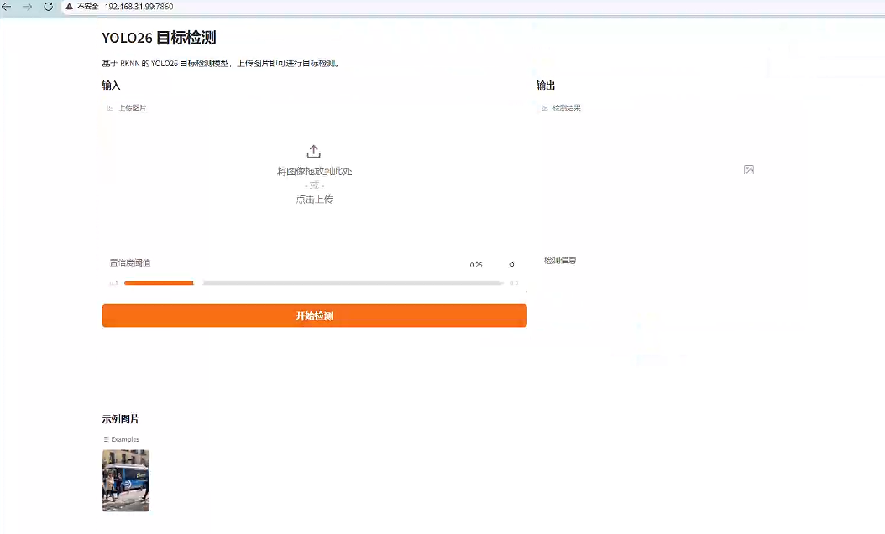

# YOLO26

基于 RKNN 的 YOLO26 目标检测模型，使用 Gradio 构建 Web 演示界面。

## 快速开始

### 1. 使用 uv 创建环境

```bash
cd yolo26-rknn/
uv sync
```

### 2. 准备模型

确保 `model/` 目录下存在对应平台的 RKNN 模型文件：

```
model/
├── yolo26n_for_rk3566_rk3568.rknn
├── yolo26n_for_rk3562.rknn
├── yolo26n_for_rk3576.rknn
├── yolo26n_for_rk3588.rknn
└── bus.jpg  # 示例图片
```

### 3. 运行程序

```bash
uv run main.py
```

或使用激活的虚拟环境：

```bash
source .venv/bin/activate
python main.py
```

启动成功后，在浏览器中访问：`http://<设备 IP>:7860`

## 示例效果



## 使用说明

1. 上传待检测图片，或点击示例图片加载测试图
2. 调整置信度阈值（默认 0.25）
3. 点击"开始检测"按钮
4. 查看检测结果和检测信息

## 链接

https://doc.embedfire.com/linux/rk356x/Python/zh/latest/ai/yolo26..html

